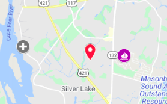
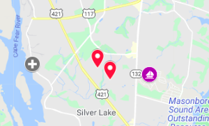
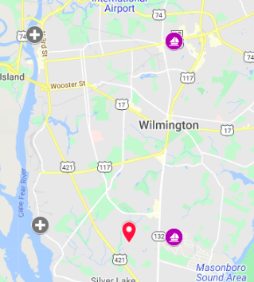
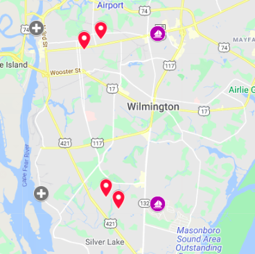

- [1. Overview](#1-overview)
  - [1.1. Problem Statement](#11-problem-statement)
  - [1.2. Purpose](#12-purpose)
- [2. Architecture](#2-architecture)
- [3. Impact Analysis](#3-impact-analysis)
- [4. Test Cases](#4-test-cases)
  - [4.1. Key](#41-key)
  - [4.2. Test Data](#42-test-data)
  - [4.3. Scenarios](#43-scenarios)
    - [4.3.1. Single Pickup, One Responder](#431-single-pickup-one-responder)
    - [4.3.2. Multi Pickup, One Responder,](#432-multi-pickup-one-responder)
    - [4.3.3. Single Pickup, Two Responders](#433-single-pickup-two-responders)
    - [4.3.4. Multi Pickup, Two Responders](#434-multi-pickup-two-responders)
    - [4.3.5. Multi Pickup, One Responder, Boat Capacity Exceeded](#435-multi-pickup-one-responder-boat-capacity-exceeded)
    - [4.3.6. Multi Pickup, Two Responders, One Medical](#436-multi-pickup-two-responders-one-medical)
- [5. Appendix](#5-appendix)
  
# 1. Overview
## 1.1. Problem Statement

The **incident response problem** consists of a set of potential incidents (with rescuees waiting for help) and a limited number of **shelters (evacuation centers)** and **responders** that need to be assigned on a **rescue mission**. 

## 1.2. Purpose
The goal is to assign a rescue mission to the nearest available responder, to minimize the route distance beteween the incident location and a shelter destination, and to maximize the number of rescuees on board of a responder's boat considering its maximum capacity.

You can see a sample **incident response problem** on the picture below. Red pins  represent incident locations, purple circles represent potential responder boats and grey circles represent shelter destinations (evacuation centers).

To understand the problem better, see the different scenarios depicted in section 4.3.

A single responder has a **boat capacity** that only allows it to get on board a limited number of rescuees, so the **number of people** (and possibly the need for **medical assistance**) affected by the reported incident has to be informed. A list of **shelter destinations** that a responder can move rescuees to have been defined by the Incident Commander. Each shelter destination has its geo coordinates (lat & lon) that are used to determine its distance from the incident location.

The challenge is create a mission consisting of an optimized set of incidents that maximizes responder boat capacity and other considerations such as distance to evacuation centers and medical attention requirements. 

# 2. Architecture
# 3. Impact Analysis
# 4. Test Cases

## 4.1. Key
* [Map](https://www.google.com/maps/d/u/0/edit?hl=en&mid=1jHqK76mb6NUcxlomcNLDoVm9zXeu-ayB&ll=34.18821162394133%2C-77.9599111328125&z=12)

* **Shelters:**
  *    Port City Marina            :   34.2461, -77.95189
  *    Wilmington Marine Center    :   34.1706, -77.949
  *    Carolina Beach Yacht Club   :   34.0583, -77.88849

* **Responders:**
  *  Leonardo Echevarria         :    34.24352, -77.88472
  *  Jose Hernandez              :    34.16616, -77.88472

* **Incidents:**
  *  Stacy Jefferson             :   34.24068  -77.91596
  *  Jessica Adams               :   34.23614  -77.92523
  *  Jacob Barber                :   34.16906  -77.91329
  *  Reagan Wilson               :   34.16343  -77.90648

## 4.2. Test Data

[Test Data Directory](../src/test/resources/scenario1)

## 4.3. Scenarios

### 4.3.1. Single Pickup, One Responder

* **Scenario:**
  1 incident with 5 evacuees and no medical required
  1 responder with boat capacity of 10 and no first aid kit

  

* **Expectations:**
  J. Hernandez picks-up and transports R. Wilson to Wilmington Marine Center

### 4.3.2. Multi Pickup, One Responder, 
* **Scenario:**
  2 incidents with 8 evacuees total and no medical required
  1 responder with boat capacity of 10 and no first aid kit
  
* **Expectations:**
  J. Hernandez picks-up evacuees of both incidents and transports to Wilmington Marine Center
  
### 4.3.3. Single Pickup, Two Responders
* **Scenario:**

    
    
* **Expectations:**
  J. Hernandez picks-up evacuees of single incident and transports to Wilmington Marine Center
  
### 4.3.4. Multi Pickup, Two Responders
* **Scenario:**

  
  
* **Expectations:**
  Each responder closest to set of incidents picksup corresponding evacuees and transports to closest Evacuation Center
  
### 4.3.5. Multi Pickup, One Responder, Boat Capacity Exceeded
* **Scenario:**

  
  
* **Expectations:**
  J. Hernandez picks-up evacuees closest to him and then either drops off at Wilmington Marine Center or picks up Jessica Adams and drops off at Port City Marina
  
### 4.3.6. Multi Pickup, Two Responders, One Medical
* **Scenario:**

    
    
* **Expectations:**
  Jose Hernandez picks up J. Adams, Stacy Jefferson & J. Barber
  Leonardo Echevarria picks up Reagan Wilson

# 5. Appendix
* **Scenario:**
* **Expectations:**

